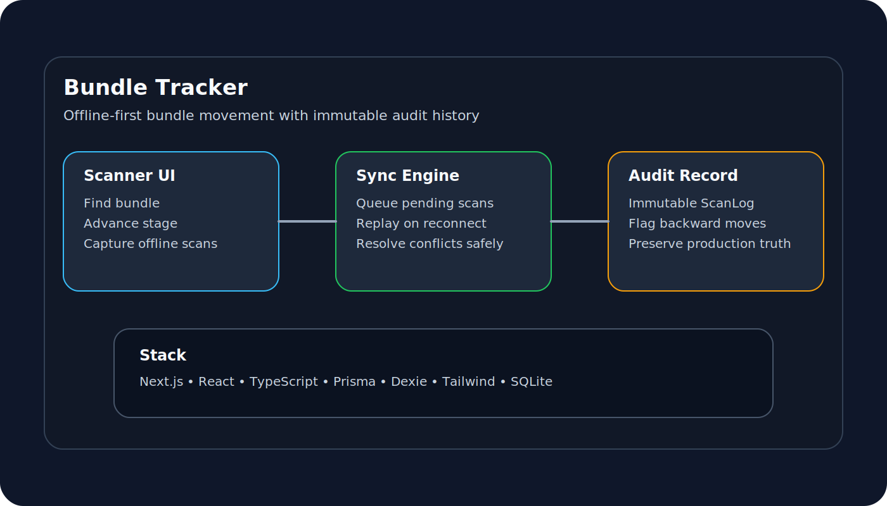
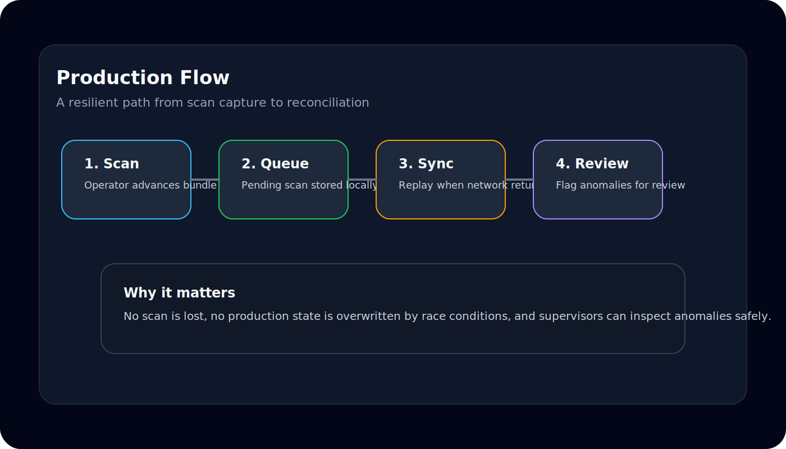

# Bundle Tracker

Bundle Tracker is a production-oriented demonstration of an offline-first Manufacturing Execution System (MES) workflow built as a vertical slice of **Project Nexus**.

The application tracks garment bundles as they move through production stages while maintaining a complete immutable audit trail. Operators can continue scanning bundles even without network connectivity, and queued scans are automatically synchronized once connectivity returns.



---

# Project Objective

This project was built as part of the Connoisseur Fashions Project Nexus Engineering Build Challenge.

The goal was to implement one complete vertical slice of the shop-floor module that demonstrates:

- Bundle tracking
- Production stage progression
- Offline-first scanning
- Automatic synchronization
- Immutable audit history
- Conflict detection and resolution

---

# Features

- Track bundles through Cutting, Sewing, Finishing and Packing
- View live bundle status from the dashboard
- Search bundles quickly
- Advance bundles through production stages
- Capture scans while offline
- Queue offline scans locally
- Automatically synchronize queued scans
- Preserve an immutable audit trail
- Detect and flag conflicting stage movements
- View complete bundle history including timestamps, device IDs and audit IDs

---

# Workflow



1. Operator scans or enters a Bundle ID.
2. The application retrieves the current production stage.
3. The operator advances the bundle.
4. If online:
   - the scan is immediately written to the database.
5. If offline:
   - the scan is stored locally in IndexedDB.
6. When connectivity returns:
   - queued scans synchronize automatically.
7. Every scan remains permanently available in the audit history.

---

# Technology Stack

| Technology | Used For |
|------------|----------|
| **Next.js 15** | Web application framework, routing and API Route Handlers |
| **React 19** | User Interface |
| **TypeScript** | Type-safe application development |
| **Tailwind CSS** | Styling and responsive layouts |
| **Prisma ORM** | Database access layer |
| **SQLite** | Demo database |
| **Dexie.js** | IndexedDB wrapper for offline queue |
| **Zod** | Request validation |
| **Node.js** | Runtime environment |

---

# Architecture

```
Browser
      │
      ▼
Next.js Frontend
      │
      ▼
API Route Handlers
      │
      ▼
Service Layer
      │
      ▼
Prisma ORM
      │
      ▼
SQLite Database
```

Offline workflow

```
Scanner

↓

IndexedDB (Dexie)

↓

Pending Queue

↓

Sync Engine

↓

POST /api/sync

↓

SQLite
```

---

# Project Structure

```
app/
│
├── Dashboard
├── Scanner
├── Bundle Details
└── API Routes

components/
│
├── Badge
├── Timeline
├── DataTable
└── Shared UI Components

hooks/
│
├── Offline Sync
├── Connectivity
└── Bundle Hooks

modules/
│
├── Bundles
├── Scans
└── Sync Services

offline/
│
├── IndexedDB
├── Queue
└── Sync Engine

prisma/
│
├── Schema
├── Migrations
└── Seed Data

services/
│
└── Frontend API Clients
```

---

# Database Design

The application stores two primary entities.

## Bundle

Represents the current production state.

Contains

- Bundle ID
- Order
- Style
- Size
- Quantity
- Current Stage
- Status

## ScanLog

Represents an immutable audit record.

Contains

- Bundle
- Stage
- Scanned Time
- Received Time
- Device ID
- Client ID
- Audit ID
- Flag information

Every production movement creates a new ScanLog entry.

Existing history is never modified.

---

# API Endpoints

| Method | Endpoint | Description |
|---------|----------|-------------|
| GET | `/api/bundles` | List bundles |
| GET | `/api/bundles/:id` | Get bundle details |
| POST | `/api/bundles` | Create bundle |
| POST | `/api/bundles/:id/scan` | Advance bundle |
| POST | `/api/sync` | Synchronize offline queue |

---

# Getting Started

## 1. Clone the repository

```bash
git clone <repository-url>
cd bundle-tracker
```

---

## 2. Install dependencies

```bash
npm install
```

---

## 3. Configure the database

```bash
npx prisma migrate dev
```

---

## 4. Seed sample data

```bash
npm run db:seed
```

---

## 5. Start the application

```bash
npm run dev
```

Open

```
http://localhost:3000
```

---

# Verification

Verify the project before running the demo.

```bash
npm run build
npm run lint
npm run test:api
```

---

# How to Demonstrate

## Online Workflow

1. Open Dashboard
2. Search for a bundle
3. Open Scanner
4. Find the bundle
5. Advance to the next stage
6. Open Bundle Details
7. Verify the new audit entry

---

## Offline Workflow

1. Enable **Simulate Offline**
2. Advance a bundle
3. Observe the Pending Queue increase
4. Disable Offline mode
5. Verify automatic synchronization
6. Verify the queue clears

---

## Conflict Demonstration

1. Open two browser windows
2. Enable Offline mode in both
3. Scan the same bundle differently
4. Reconnect both browsers
5. Open Bundle Details
6. Observe:
   - immutable history
   - flagged conflict
   - preserved production state

---

# Design Decisions

## Stage Computation

The current production stage is derived from the highest valid production stage rather than the most recently synchronized scan.

---

## Immutable Audit Log

Every scan creates a permanent audit record.

No production history is overwritten or deleted.

---

## Conflict Resolution

If two offline devices synchronize conflicting stages, the application:

- preserves every scan
- flags backward movements
- retains the highest valid production stage

---

# Future Improvements

For a production deployment the following would be added:

- PostgreSQL instead of SQLite
- Authentication and Role-Based Access Control
- Barcode / QR Scanner integration
- React Native shop-floor application
- Supervisor conflict review workflow
- Real-time notifications
- Cloud deployment
- Device registration and identity management

---

# Acknowledgements

This project was developed as a hiring assessment for **Connoisseur Fashions – Project Nexus**.

AI-assisted development tools were used to accelerate implementation, while the overall architecture, design decisions, conflict resolution strategy, and system behaviour were planned, reviewed, and validated by the author.
